# 🧩 RimWorld Mod Showcase

🎮 **関連リポジトリ / Related Repositories**

| 🧱 Mod名 | 🌐 GitHubリンク |
|----------|----------------|
| NareisLib（多層レンダリングフレームワーク） | [🔗 NareisLib Repository](https://github.com/Kamijouko/NareisLib) |
| RimSpine2DFramework（Spine2D動的レンダリング） | [🔗 RimSpine2DFramework Repository](https://github.com/Kamijouko/RimSpine2DFramework/tree/1.6) |
| Arknights StoryTeller（アニメーション立絵付きストーリーテラーMod）

## 🧰 ソースコード（.sln）での DLL 参照設定

ソースコードを直接開発・確認したい方向けの手順です。  
本プロジェクトのソースコードは **C#** で記述されており、  
**Visual Studio（推奨：Visual Studio 2022）** での編集を前提としています。  

また、いくつかの外部ライブラリ（DLL）を参照しています。  
必要な DLL は **Releases** に同梱していますので、以下の手順で設定してください。

※ すべてのアーカイブ（.7z）は 7-Zip 等で解凍してください。  
（7-Zip は無料で利用可能です：<a href="https://www.7-zip.org" target="_blank">https://www.7-zip.org/</a>）

---

### 🔹 手順

1. **Releases** ページから **`Managed-1.6.7z`** をダウンロードします。  
2. ダウンロード後、アーカイブを解凍し、`Managed-1.6/` フォルダを用意します。  

3. **Visual Studio** を起動し、ソースフォルダ内にある **`.sln` プロジェクトファイル** を開きます。  
   （例：`NareisLib.sln` または `RimSpine2DFramework.sln`）

4. Visual Studio の上部メニューから  
   **「プロジェクト(P)」 → 「参照の追加(R)...」** を選択します。  
   <!---->

5. 「参照マネージャー」ウィンドウが開いたら、右下にある **「参照(Browse)...」** ボタンをクリックします。  
   <!---->

6. 解凍した **`Managed-1.6/` フォルダ** を開き、フォルダ内のすべての `.dll` ファイルを選択して「追加」をクリックします。  

7. 「OK」 を押して参照を確定します。  
   その後、エディター内で **赤字のエラー表示が消えていることを確認** してください。  

> 💡 `Managed-1.6/` 内の DLL は **すべて選択して一括追加** することが可能です。  
> プロジェクトごとに DLL のパスが異なる場合は、同じ手順で再設定してください。

---

私のRimWorld用Mod紹介ページをご覧いただき、ありがとうございます。  
このページでは、ゲームの進行に合わせて以下のModを順に紹介していきます：

---

## 🚀 体験を始めるには

GitHubリポジトリの **Releases** から  
💾 デモ用ゲームファイル「RimWorld-1.6.7z」 と 💾 セーブデータ「DemoSave.rws」 の2つのファイルをダウンロードしてください。  

ダウンロード後、アーカイブ内の **「RimWorld-1.6.7z」** を解凍することで、紹介の内容をすぐにお楽しみいただけます。  

まず、解凍後の **「RimWorld-1.6」** フォルダを開き、  
その中にある **「RimWorldWin64.exe」** をダブルクリックしてゲームを起動してください。  

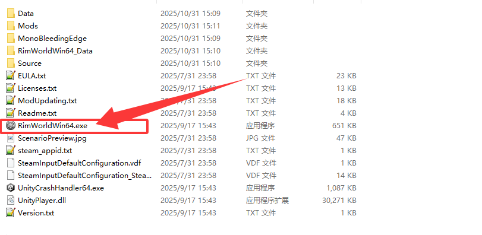  
*図1：解凍後のフォルダと実行ファイル*

---

## ⚠️ 起動時の注意

PCにSteamがインストールされていない場合、またはライブラリ内に『RimWorld』が含まれていない場合、  
起動時に右図のようなメッセージが表示されます。  
その際は、「無視」ボタンをクリックすることで問題なくプレイを続行できます。  

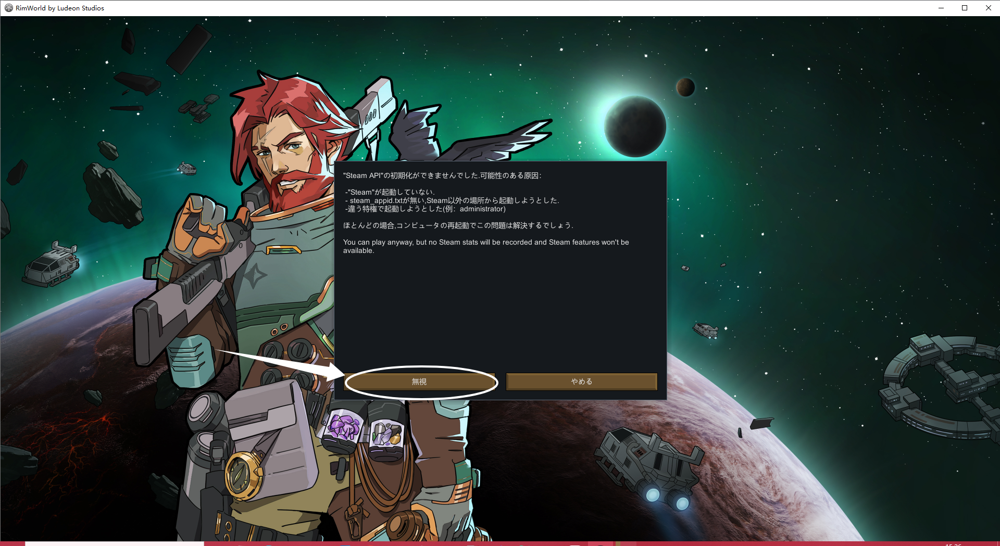  
*図2：Steamが未インストール時に表示されるメッセージ*

起動後に日本語が表示されていない場合は、図に示したボタンをクリックして日本語に変更してください。  
ただし、**HumanroidAlienRace** というModにバグが存在するため（私が発見し、現在作者に報告を試みています）、  
言語を変更した後は手動でゲームを再起動してください。  

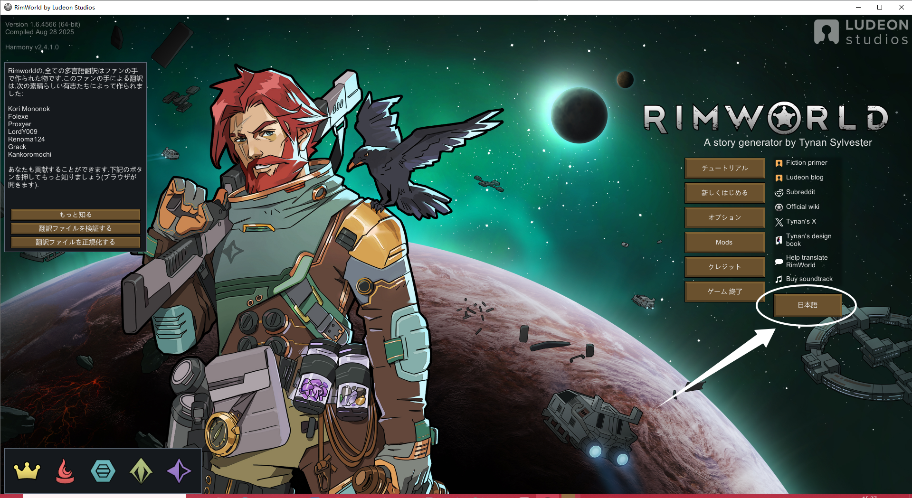  
*図3：日本語設定の例*

---

## 🧱 Mod紹介

メインメニューの「Mod」ボタンをクリックすると、現在読み込まれているすべてのModを確認できます。  

💡 **初回起動時の注意**

初めてゲームを起動した際、**Modリストは空の状態**になっています。  
その場合は、下図の手順に従い、**左側の一覧から右側へModをドラッグ＆ドロップ**してください。  
すべてのModを正しい順序で並べ替えたことを確認したら、  
**メニュー右下の「変更を適用して保存する」ボタン**をクリックし、ゲームを自動再起動して読み込みを行ってください。  

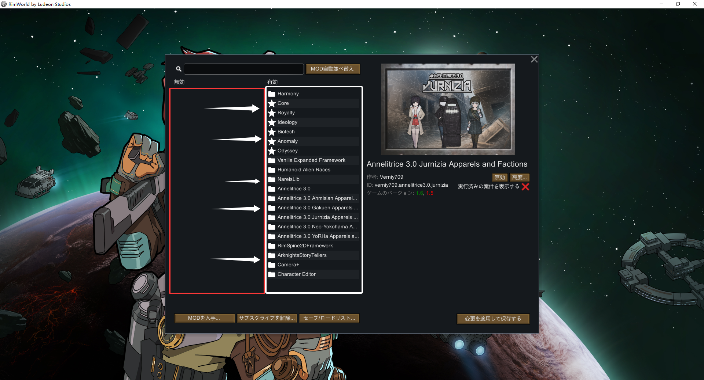  
*図：Modリストの設定手順*

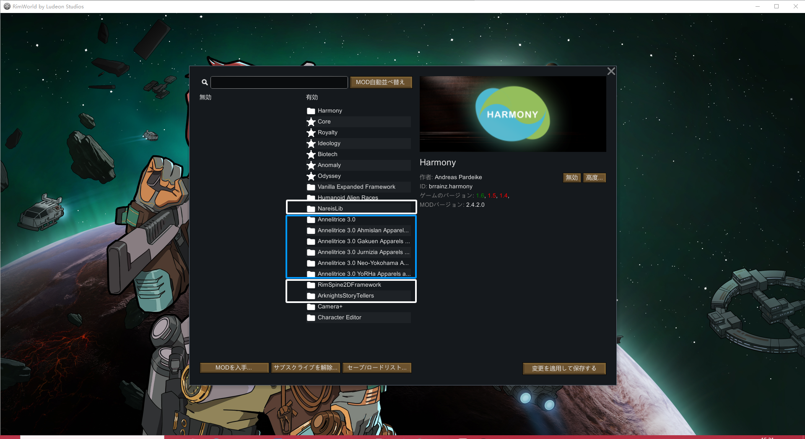  
*図4：Modリスト画面*

図の一番上の白枠にある **NareisLib** は、私が開発した多層レンダリングModです。  
その下の青枠に表示されているのは、私の知り合いの協力者が **NareisLib** を基盤として開発した新種族Modシリーズ **Annelitrice** です。  
彼の優れた開発のおかげで、NareisLib の潜在的な可能性が見事に示されました。 o7  

さらに下の白枠には、私が開発した **Spine2D レンダリングフレームワーク** が含まれています。  
**Spine2D** は、2Dの動的な表現を可能にする優れたツールで、多くのゲームでエフェクトやキャラクター立ち絵のアニメーションに使用されています。  
**Live2D** よりも軽量で、ゲーム内への統合に適しています。  

<!--  
*図5：Spine2Dアニメーション例*-->

私のフレームワークでは RimWorld のナレーターに Spine2D の動的演出を追加しており、  
現在開発中のバージョンでは、ゲーム内キャラクターが Spine2D のステートマシンに対応する機能も実装しています。  
後ほど順に紹介します。  

最下部の **Arknights StoryTeller** は、Spine2D フレームワークによるナレーター動的立ち絵機能を実際に体験できるデモModです。  
スマートフォンゲーム『Arknights（明日方舟）』には美しいSpine2Dアニメーションのキャラクター立ち絵が多く存在し、二次創作も奨励されています。  
そこで、私はその中から3名のキャラクターのリソースをお借りし、RimWorldのナレーターとして再現しました。こちらも後ほど紹介します。  

<!--  
*図6：ナレーターの動的立ち絵例*-->

---

## 💾 セーブデータ導入

次にメインメニューへ戻り、右図を参考に 「オプション」 ボタンをクリックしてください。  

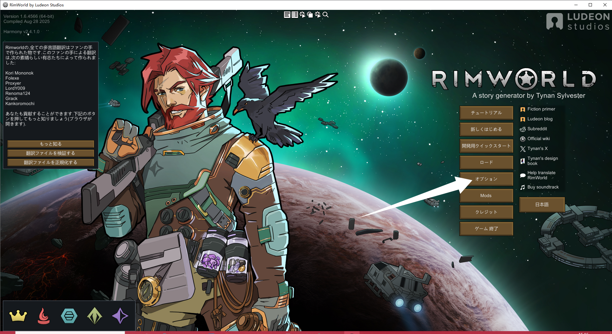  
*図5：「オプション」ボタンの位置*

続いて、「セーブデータフォルダ」の右側にある 「開く」 ボタンを押すと、図のようにゲームのセーブデータ保存フォルダが開きます。  

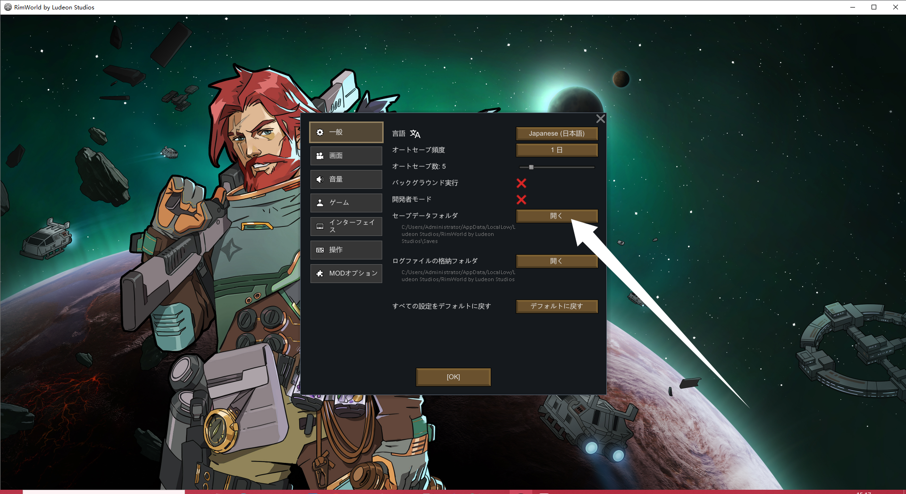  
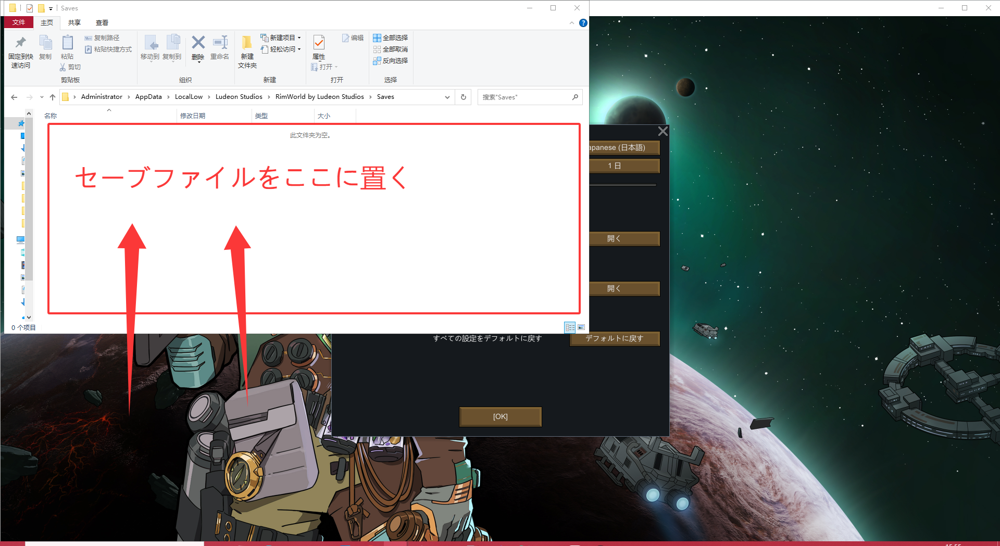  
*図6,7：セーブデータフォルダの場所*

お手数を省くため、ダウンロードいただいたゲーム体験パッケージ内には、「DemoSave.rws」 という名前のセーブデータファイルを同梱しています。  
このファイルは、私があらかじめMod内容を体験できるよう準備したプリセットセーブデータです。  
そのため、「DemoSave.rws」ファイルを先ほど開いたセーブデータフォルダにコピーしていただければ、  
ゲーム内で直接このセーブデータを読み込み、すぐにModの内容を体験できます。  

---

「OK」をクリックしてメインメニューに戻ります。  
その後、「ロード」 ボタンをクリックし、先ほどコピーした 「DemoSave」 という名前のセーブデータの右側にある 「ロード」 ボタンを押すと、ゲームに入ることができます。  

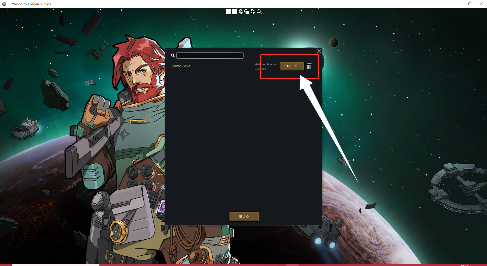  
*図8：セーブデータのロード画面*

---

## 🎮 ゲーム操作と確認

ゲームに入った後、マウスのホイールボタン（中央ボタン）をドラッグするか、または W・A・S・Dキー を使用して視点を移動できます。  
マウスホイールの回転で、ズームイン・ズームアウトも行えます。  

画面上部に表示されているキャラクター一覧が、現在プレイヤーが操作できるキャラクターです。  
そのうち左から3名のキャラクターは、NareisLibフレームワークを利用して生成されたキャラクターです。  

画面右下にある図示のボタンをクリックすると、キャラクターエディターが開きます。  

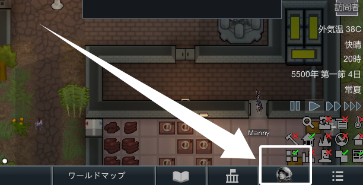  
*図9：右下にある図示のボタン*

エディター画面の左側の白枠エリアでは、編集または閲覧したいキャラクターを選択できます。  
青枠エリアでは、編集するカテゴリを選択し、黄枠エリアで選んだカテゴリの詳細設定を変更できます。  

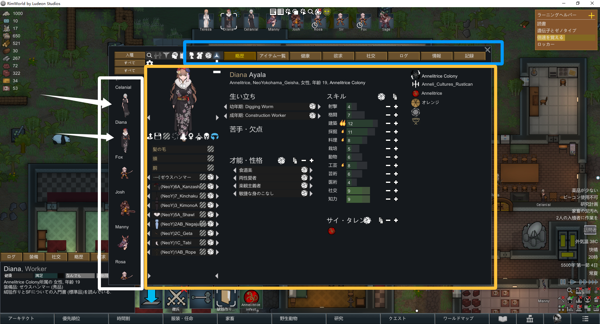  
*図10：キャラクターエディターUI構成*

黄枠エリア内の図示ボタンをクリックすると、キャラクターの各方向を確認できます。

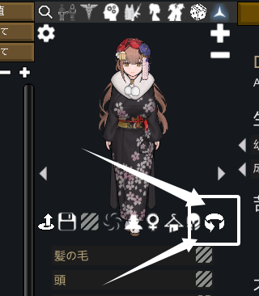  
*図11：各方向を確認ボタン*

青枠エリアの 「アイテム一覧」 をクリックすると、キャラクターの服装や装備を編集できます。  
右図の白い矢印で示したボタンを押すと、さまざまな装備を着脱できます。  

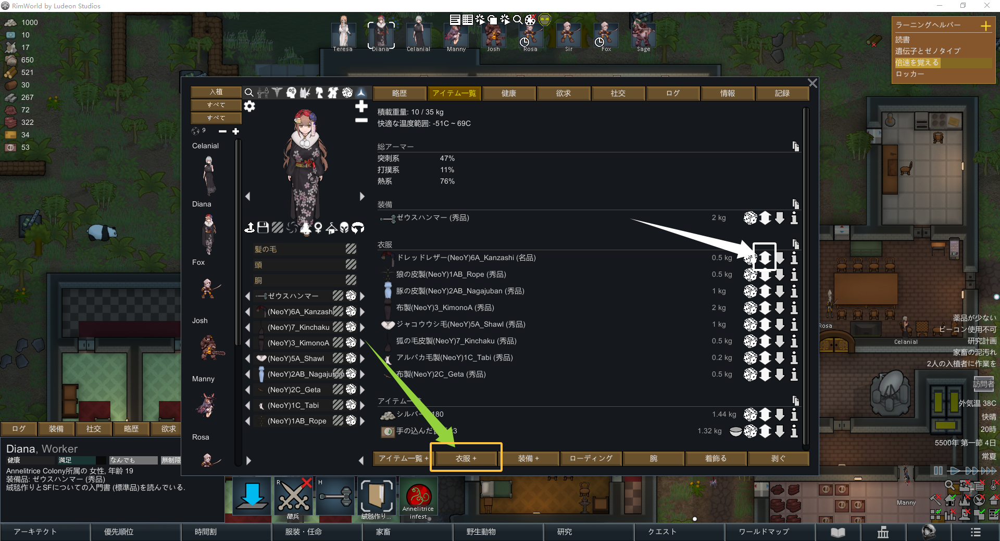  
*図12：服装や装備を編集*

⚠️ **注意**：キャラクターが全身の装備をすべて外すと、NSFW要素（成人向け表現）が含まれます。  
職場など公共の環境でプレイされる場合は、特にご注意ください。  

黄色い矢印で示したボタンを押すと、新しい服装を追加できます。  
ここで、**NareisLib** が服装ごとのレンダリング深度やマテリアルを正しく処理している様子をご覧いただけます。  

<!--  
*図12：装備と描画深度の制御例*-->

（旧バージョンの RimWorld では「画面下にある画像ほど先に描画される」仕組みのため、  
NareisLib では毎フレームすべての画像の描画優先度を正確に処理し、特定の画像の優先度を変更した際も他の画像が正しく保持されるよう制御しています。）  

---

## 🧠 Spine2Dキャラクターと動作例

次に、右上のボタンをクリックしてキャラクターエディターを閉じ、マップ上の他のキャラクターを確認してみてください。  
一部のキャラクターは橙色のハイライトがあり、アニメーション表現を持っています。  
これらのキャラクターは、**Spine2D 技術** を利用した特別なキャラクターです。  

<!--  
*図13：Spine2Dによるアニメーションキャラクター*-->

私が構築した Spine2D フレームワークによって、各キャラクターが独立したステートマシンを持ち、  
ゲーム本来のメカニクスを正しく認識して対応するアニメーションを自動的に再生することができます。  

さらに、これらのパラメータはすべて **XML 言語のみで定義可能** であり、  
他のMod制作者が複雑なプログラミングを学ばなくても容易に利用できます。  
これにより、Mod 制作のハードルを大幅に下げ、拡張性と利便性を両立しています。  

マウスでキャラクターを選択し、図の矢印で示されたボタンをクリックするか、キーボードの **Rキー** を押すことで、キャラクターを操作モードに切り替えられます。  
この状態では、地面や他のオブジェクトを右クリックすることで、キャラクターに対応する行動を指示できます。  

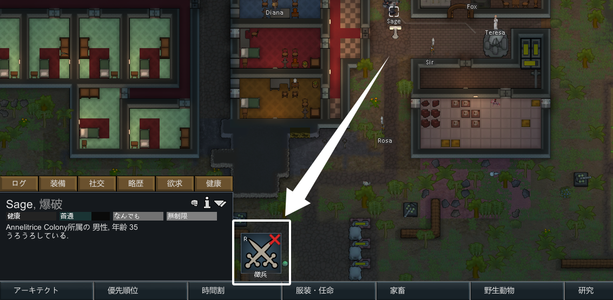  
*図13：操作モードでの行動指示例*

---

## 🤖 AIストーリーテラー

最後に、画面右下のボタンをクリックするとメニューを開けます。  
「オプション」 → 「ゲーム」 → 「ストーリーテラー選択」 → 「変更」 の順にクリックしてください。  

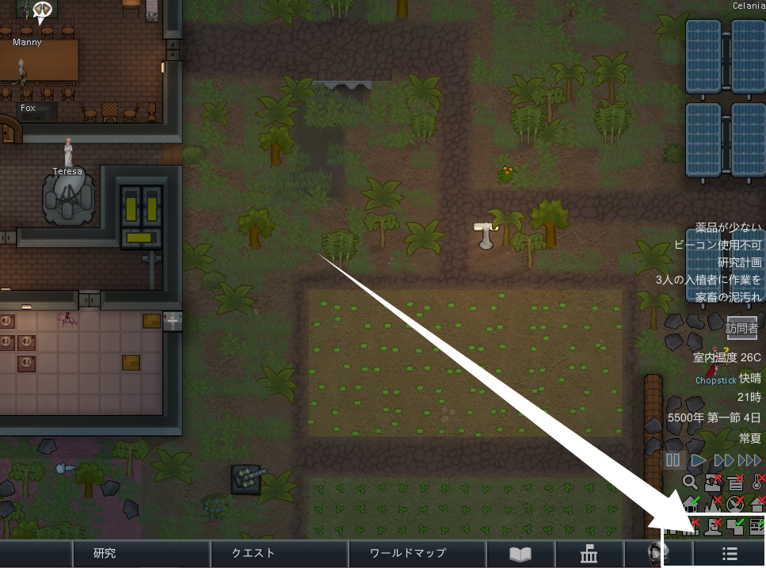  
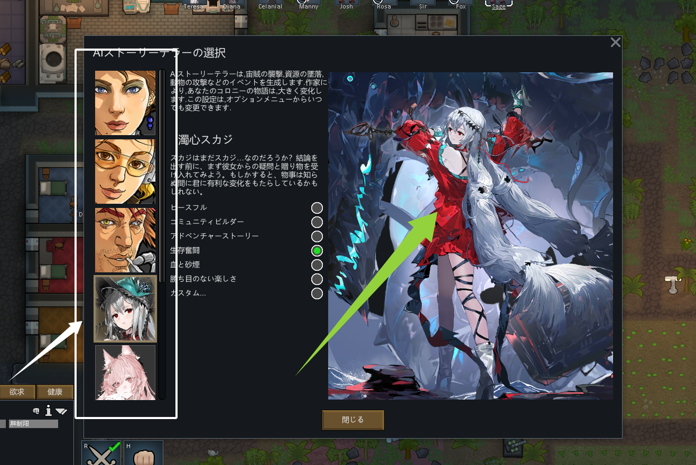  
*図14,15：AIストーリーテラー選択画面*

左側のリストにはストーリーテラーが並んでおり、リスト下部の3名がSpine2Dを利用して制作された動的立ち絵付きのストーリーテラーです。  
それぞれをクリックすると、特別なインタラクションやアニメーションを確認できます。  

また、これらのストーリーテラーには特定の条件で発生する専用イベントが含まれており、プレイ中にランダムで発生することがあります。  
今後はさらに、**言語モデルや音声モデルを連携させ、真の「AIストーリーテラー」**として機能させることを目指しています。  

---

## 🧵 終わりに

以上で紹介はすべてとなります。  
なお、**NareisLib** を基盤として開発された **Annelitrice 種族** には、他にも多くの美しい衣装や独自のゲームシステムが実装されていますが、ここでの説明は割愛させていただきます。  

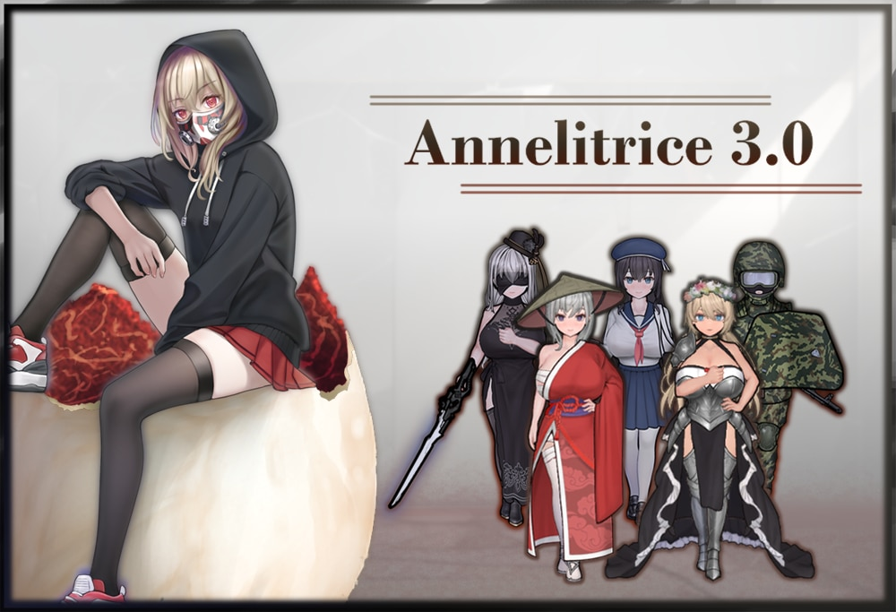  
*図16：Annelitriceキャラクター例*

最後までご覧いただき、誠にありがとうございました。🙌
